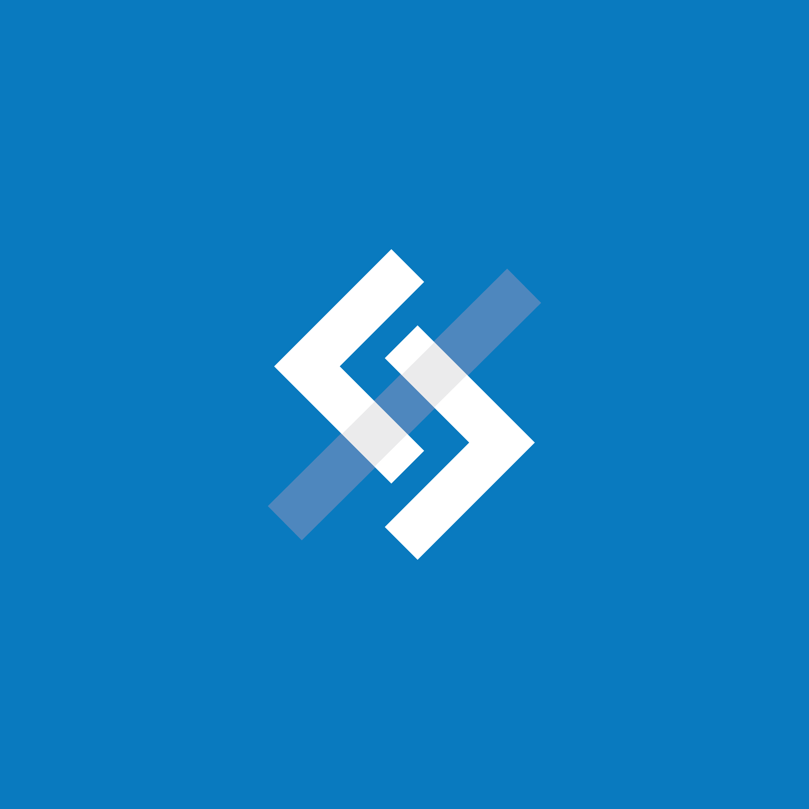
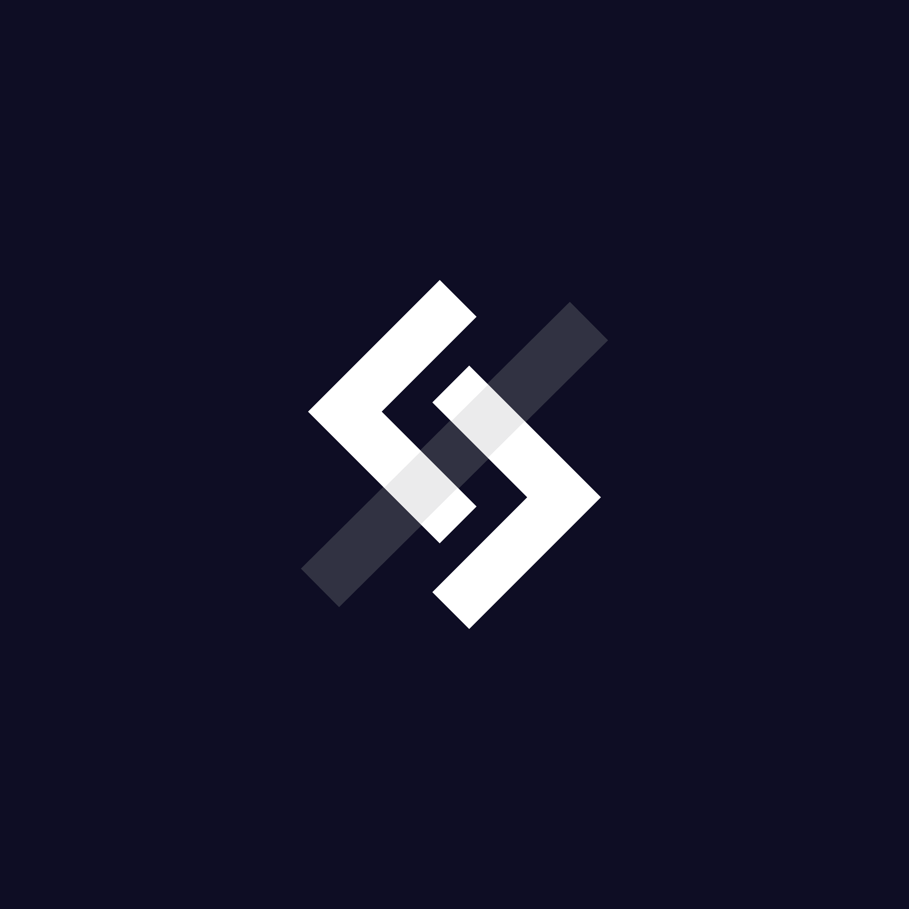
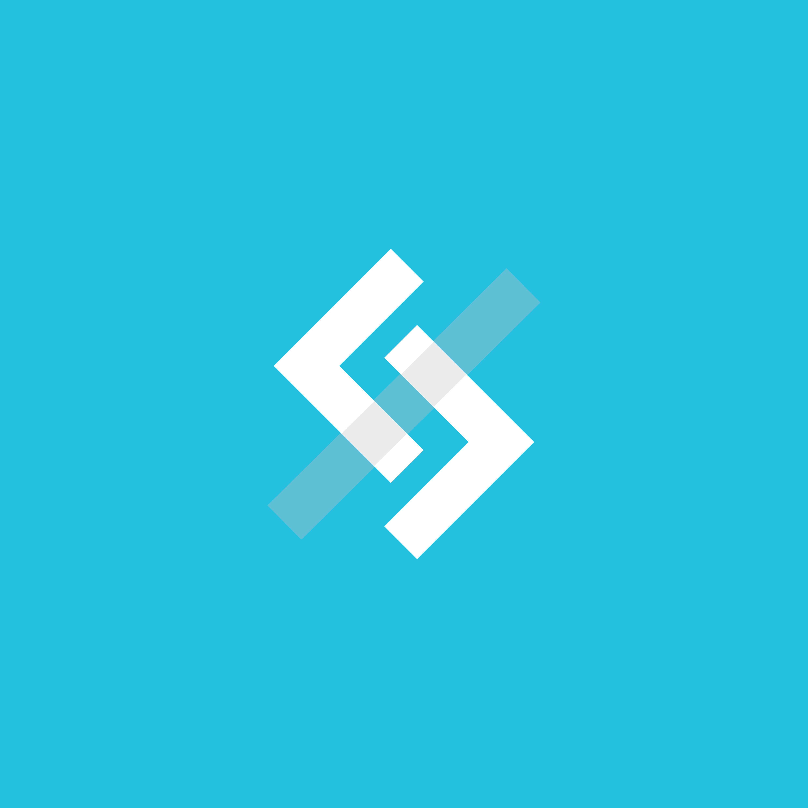
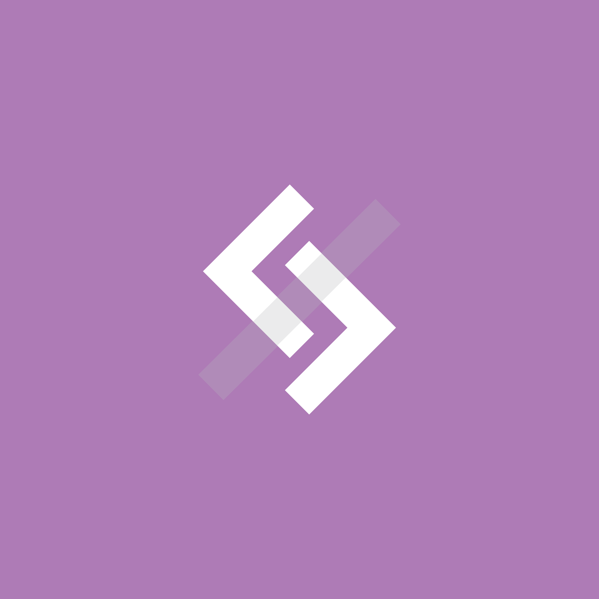
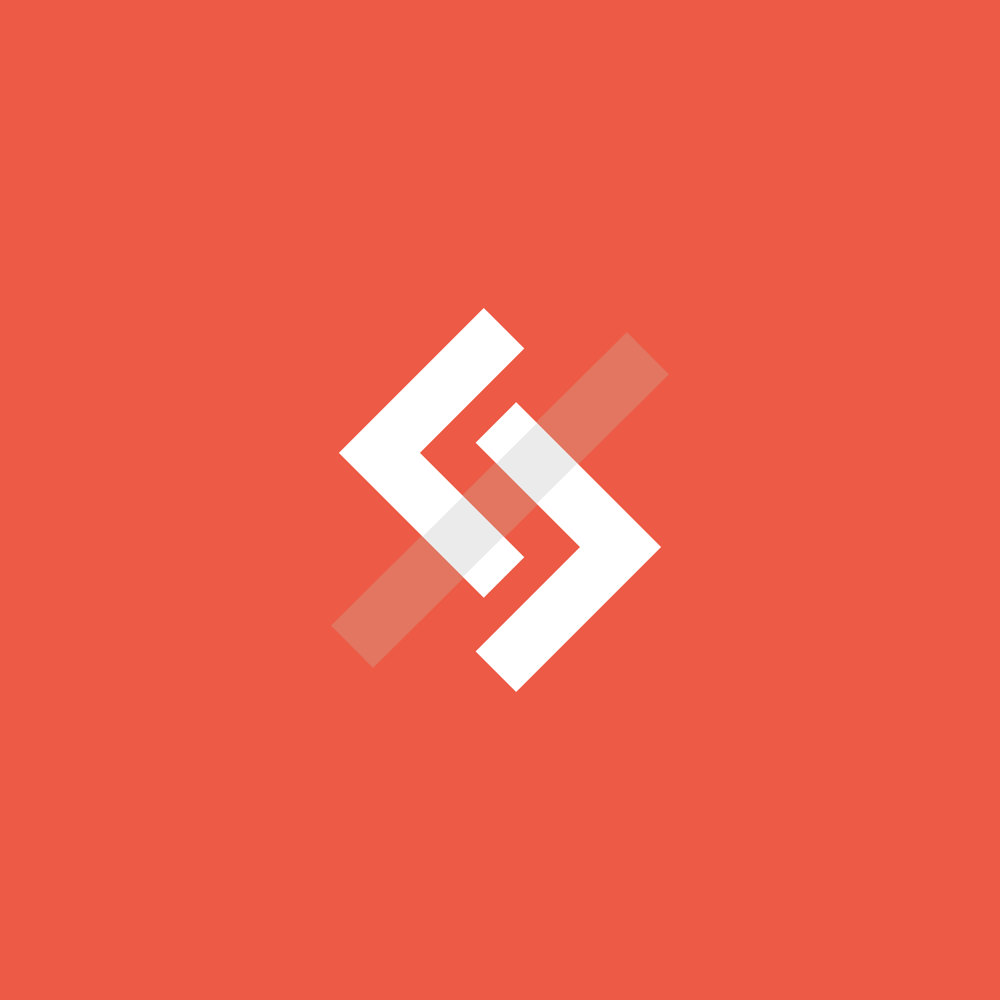
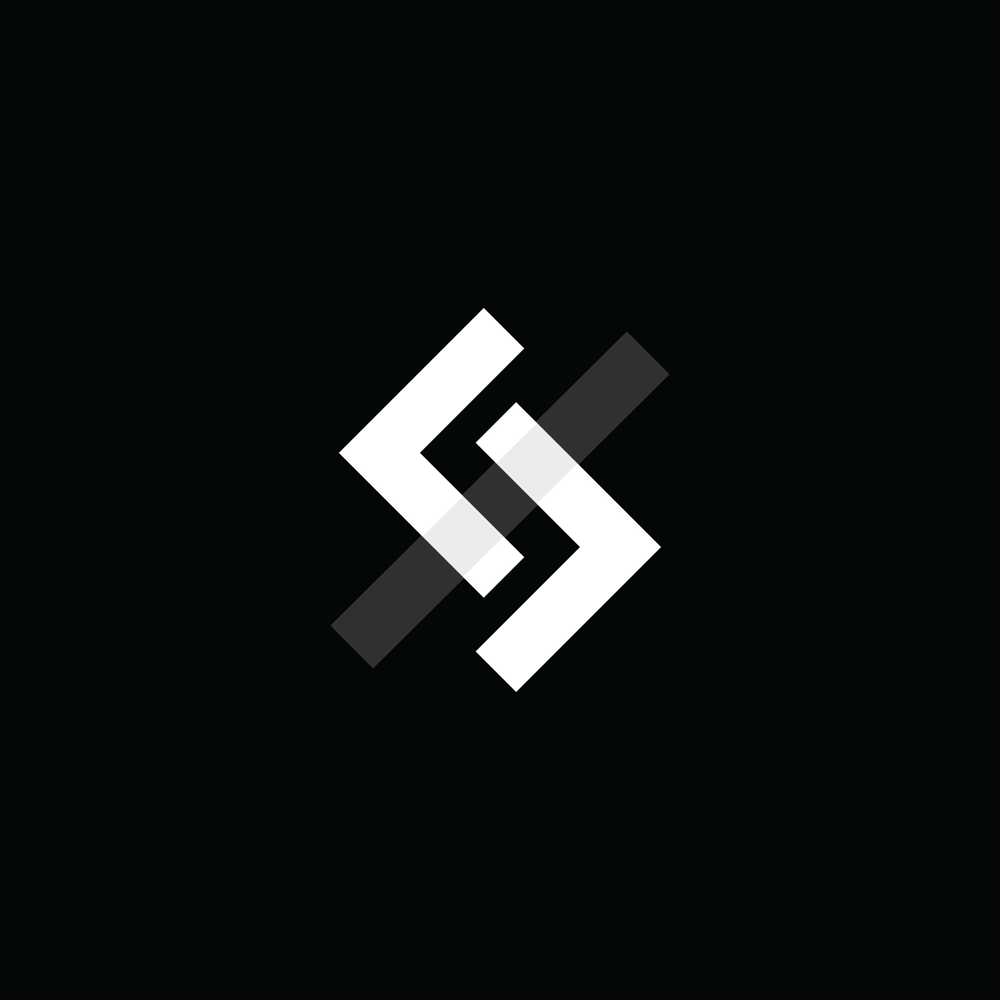
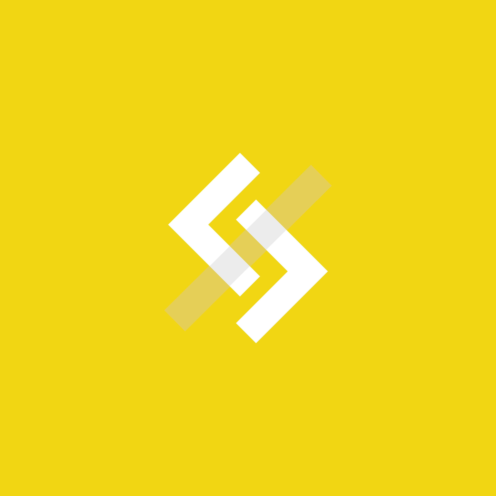

[![Issues][issues-shield]][issues-url]
[![GPL-3.0 License][license-shield]][license-url]
[![LinkedIn][linkedin-shield]][linkedin-url]

<br />
<p align="center">
  <a href="https://github.com/rhdevs/rhapp/">
    
  </a>
  <h3 align="center">The Raffles Hall App</h3>
  <p align="center">
    Nobody asked:
    <br />
    RHdevs:
    <br/>
    <br/>
    <a href="https://github.com/github_username/repo_name"><strong>(Coming Soon!) View the App</strong></a>
    <br />
  </p>
</p>

<details open="open">
  <summary><h2 style="display: inline-block">Table of Contents</h2></summary>
  <ol>
    <li>
      <a href="#the-project">The Project</a>
      <ul>
        <li><a href="#built-with">Built With</a></li>
        <li><a href="#built-with">About Us (RHDevs)</a></li>
      </ul>
    </li>
    <li>
      <a href="#getting-started">Getting Started</a>
      <ul>
        <li><a href="#prerequisites">Prerequisites</a></li>
        <li><a href="#installation">Installation</a></li>
      </ul>
    </li>
    <li><a href="#contributing">Contributing</a></li>
    <li><a href="#license">License</a></li>
    <li><a href="#contact">Contact</a></li>
    <li><a href="#acknowledgements">Acknowledgements</a></li>
  </ol>
</details>

## The Project
<!-- Insert screenshots -->
This projects is build by RHDevs on December.
More Details coming soon! :-)
<div>








</div>

### Built With

* [Python Flask](https://flask.palletsprojects.com/en/1.1.x/)
* [React with TS](https://reactjs.org/)
* [Redux](https://react-redux.js.org/introduction/quick-start)
* [PostgreSQL(?)](https://www.postgresql.org/)

### About Us
We are a CCA from Raffles Hall, National University of Singapore. Frustrated by the modernisation efforts by the nature of a gigantuan organisation, we've decided to use our knowledge and skills to ease our day-to-day life in the hostel.

With us, we have 3 main departments; The `Developers`, The Designers and The Product Managers!

## Getting Started
To run the application on your local machine, follow the steps below.
To view the hosted application, [click here instead (Coming Soon!)](http://lmao.com)

### Prerequisites
Please ensure that you have the following dependencies installed before carrying on!
* Python 3 and pip3
  ```sh
  # MacOS Developers
    brew install python
  # Windows
    ## Refer to https://www.python.org/downloads/
  # Debian/Ubuntu
    sudo apt update
    sudo apt-get install python3
  ```
* Flask 
  * Refer to https://flask.palletsprojects.com/en/1.0.x/installation/
    ```sh
    pip install Flask
    ```
* NodeJS and NPM
  ```sh
  # MacOS Developers
  # Windows
    ## Refer to 
  # Debian/Ubuntu
  ```
* PostgreSQL (?)
  ```sh
  # MacOS Developers
  # Windows
    ## Refer to
  # Debian/Ubuntu
  ```
* yarn
  ```sh
    # MacOS Developers
        brew install yarn
    # Windows
        ## Refer to https://classic.yarnpkg.com/en/docs/install/#windows-stable
    # Debian/Ubuntu
        sudo apt update && sudo apt install yarn
  ```

### Installation
#### Running both instances for testing
Run `yarn start:all` or `npm run start:all`

#### Backend-only
1. Run `. /backend/venv/bin/activate` to activate virtual env
2. Run `export FLASK_APP=testpy.py` to set entry file
3. Run `flask run` to start flask server
4. Go to http://127.0.0.1:5000/ to view the server

#### Frontend-only
1. Copy and paste `.env.template` to fill up the env variables and save as `frontend/.env`
2. run `yarn` in `/frontend` to install dependencies
3. run `yarn start` to start front-end
4. Go to http://127.0.0.1:3000/ to view the frontend


<!-- CONTRIBUTING -->
## Contributing
Our Application is currently not yet ready for open source contributions

<!-- Contributions are what make the open source community such an amazing place to be learn, inspire, and create. Any contributions you make are **greatly appreciated**.

1. Fork the Project
2. Create your Feature Branch (`git checkout -b feature/AmazingFeature`)
3. Commit your Changes (`git commit -m 'Add some AmazingFeature'`)
4. Push to the Branch (`git push origin feature/AmazingFeature`)
5. Open a Pull Request -->

## License
Distributed under the  GPL-3.0 License. See `LICENSE` for more information.

## Contact
Social Media: [LinkedIn][linkedin-url] | [Instagram][instagram-url]
Project Link: [Github Repo](https://github.com/rhdevs/rhapp) | [Application (Coming Soon!)](https://google.com)

## Acknowledgements
* []()
* []()
* []()

## Useful Tools and Links
* [ReactRouter](https://reactrouter.com/web/api/BrowserRouter)
* [Styled Components (in-line styling)](https://github.com/styled-components/styled-components)
* [Emotion (in-line styling)](https://emotion.sh/docs/introduction)

[issues-shield]: https://img.shields.io/github/issues/github_username/repo.svg?style=for-the-badge
[issues-url]: https://github.com/rhdevs/rhapp/issues
[license-shield]: https://img.shields.io/github/license/github_username/repo.svg?style=for-the-badge
[license-url]: https://github.com/rhdevs/rhapp/blob/main/LICENSE.txt
[linkedin-shield]: https://img.shields.io/badge/-LinkedIn-black.svg?style=for-the-badge&logo=linkedin&colorB=555
[linkedin-url]: https://www.linkedin.com/company/rhdevs
[instagram-url]: https://www.instagram.com/rhdevs/
